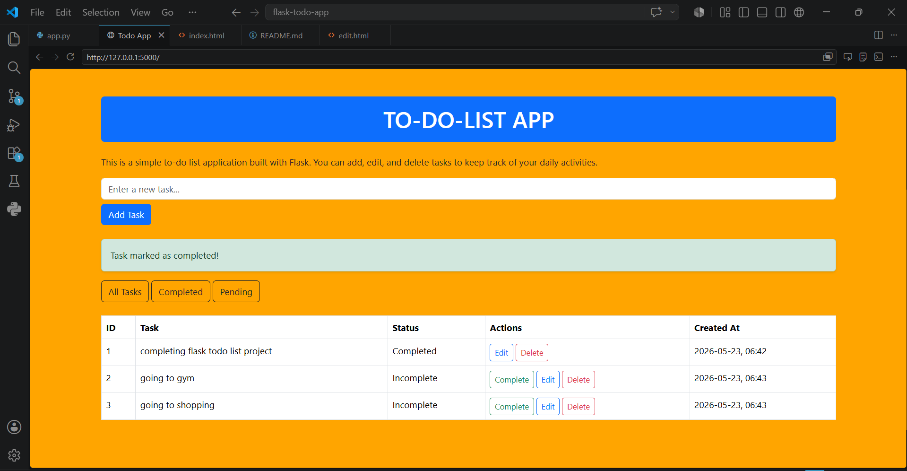
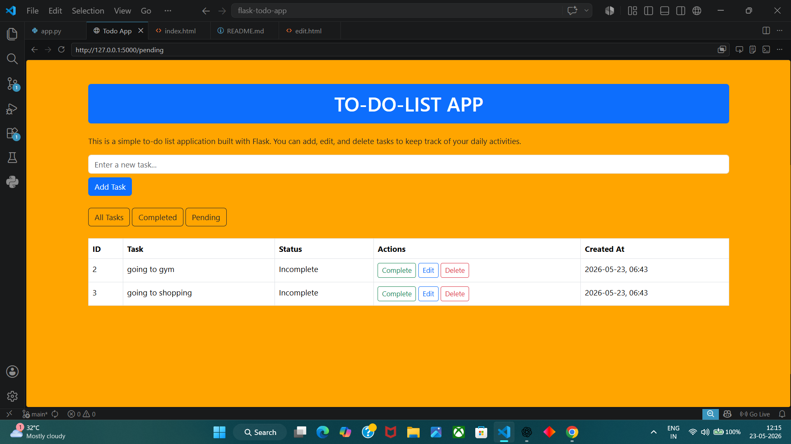
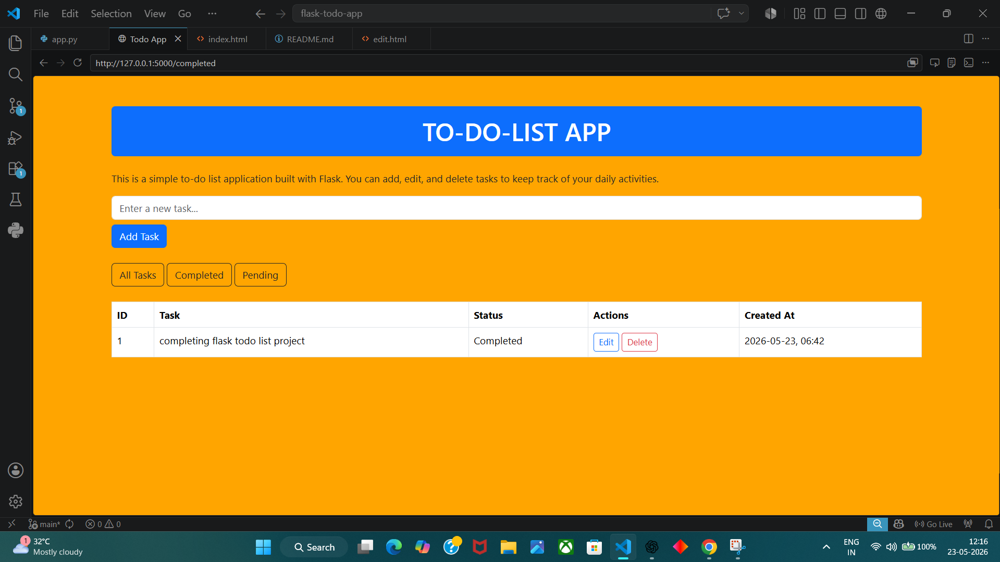
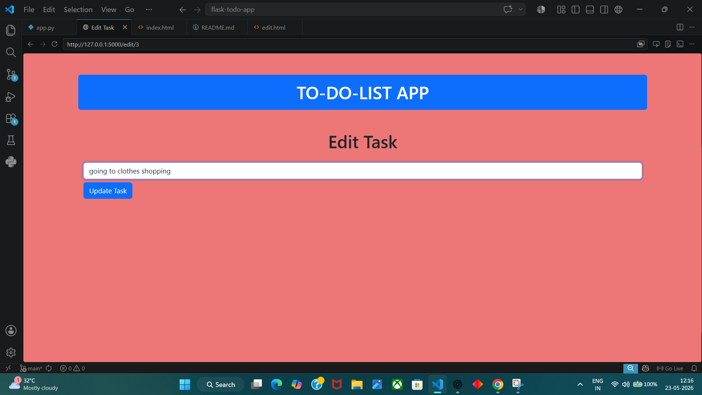

# Flask Todo App
A simple Todo App built using Flask and SQLite.
## Features

- Add Tasks
- Edit Tasks
- Delete Tasks
- Complete Tasks
- Task Filters
- Flash Messages
- Datetime Tracking
## Technologies Used

- Python
- Flask
- SQLAlchemy
- SQLite
- Bootstrap

## Installation

1. Clone repository

2. Create virtual environment

3. Install dependencies

4. Run app

```bash
python app.py
```

## Screenshots
## Screenshots

### Home Page



### Completed Tasks



### pending Tasks



### Edit page



## Live Demo

https://flask-todo-app-w82n.onrender.com